# Comparison of Methods for Estimating Future Flood Risk in New Orleans Louisiana
A summer research project conducted by Anthony Wong and Travis Torline at the University of Colorado Boulder

This project will use sea level data from New Orleans, Louisiana to make improved projections of flood risk throughout the 21st century. The currently-used calculation of flood hazard relies on some “magic numbers”. We will estimate appropriate values for those parameters using an independent and statistically rigorous approach.

As sea levels and storm surges rise due to climate change, this project will highlight important modeling uncertainties and provide recommendations for augmenting the flood protection system in New Orleans. These results will benefit the flood risk modeling community as well as the local population of New Orleans.

## Week 1

Work through starter problems to get a better feel for the R programming language (including statistical functions like quantile, graphig function like polygon, and list objects), the extRemes packages, and NetCDF files (a common file type used in meteorology, climatology, and oceanography). This will begin to give me an idea of the types of data we'll be using in our analysis and hot to clean and work with that data.

View answers to the Starter Problems in the "StarterProblems" folder.

Learn more about the exTremes package: https://cran.r-project.org/web/packages/extRemes/extRemes.pdf

Learn more about NetCDF files: https://www.unidata.ucar.edu/software/netcdf/

## Week 2 - 3

A GEV distribution has three parameters - mu (location), sigma (scale), and xi (shape). The values of these parameters can either be stationary (meaning that they don't change at all) or non-stationary (meaning that the value changes as a function of some other variable).

For this research, non-stationary values change as a function of global average temperature.

In this portion of the research, we analyze 8 .csv files of stationary and non-stationary parameter sets created by one of Tony's former students, Mingxuan Zang. Mingxuan whas uplaoded these files in the "parameters_data" folder along with the best fitting parameter sets. Each .csv file has a different combination of stationary and non-stationary parameters and 2064 values for those parameters.

It is our task to create a density distribution for each of the 8 .csv files showing 100-year storm levels for all of the 2064 parameter sets. A 100-year storm level is a storm with a sea level height that is only seen once every 100 years, and it is the minimum that cities should be preparing for.

Furthermore, we wish to show how these density distribtuions change over time as global mean temperature increases. By comapring the year 2016 to the year 2065, we can see hwo the ditribution of 100-year storms changes and whether we can expect to see higher or lower flood levels for these storms.

This portion of the project can be found in the 'ReturnLevelCalculations' folder. Specifically, look for the file titled "x100Calculations".

## Week 4

The United States Army Corps of Engineers (USACE for short) has their own model for determining what storm levels and storm surges will look like in the future. This model involves calcualting a change in sea level, pulling stationary GEV parameters, and sampling a surge factor. What isn't clear about this method, however, is where the calulcation for the Surge Factor comes from. It appears to be pulled from a uniform distribution between 1.5 and 2, but this is not clearly stated anywhere.

This week, we will begin to model the USACE against our 8 parameter sets to see how they differ. This will be done by sampling changes in sea level from 2016 to 2065, sampling stationary GEV parameters, and samplng a surge factor from a unfiform distributoiion to calcuate 100-year storm level values using the USACE's method. We will then compare the density distribution of values from this method to our own method.

Our hope is to get the distribtuons to somewhat match up by determing what the distribtuon of surge factors should be. Should it be a uniform ditribution from 1.5 to 2, or maybe from 0 to 10? Is it possible that it's not even a uniform distribtuion at all?

This portion of the project can be found in the 'ReturnLevelCalculations' folder. Specifically, look for the file titled "USACEFunction" for the function that generates values for the USACE's method and in the file titled "Driver File" for a slick and fast way to plot non-stationary distirbutions and the USACE method against one another.

## Week 5

While we have everything seemigly working correctly so far, we seem to have run into a small problem - the distributions of 100 year storms (x100) for our non-stationary parameter sets are off. Firstly, they show mu, the location parameter, decreasing over time. This is strange because common knowledge of rising sea levels would lead one to believe that mu should be increasing. Secondly, many of the distributions become incredibly wide to the point where their data is unuseable at a point. See the below gifs for a visual of all 8 GEV parameter sets and how the GEV shifts from 2016 to 2065:

### Parameter Set 2
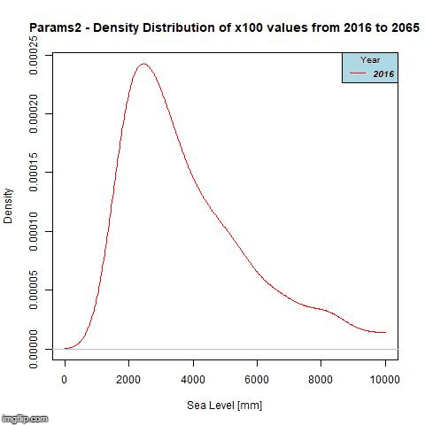

### Parameter Set 3
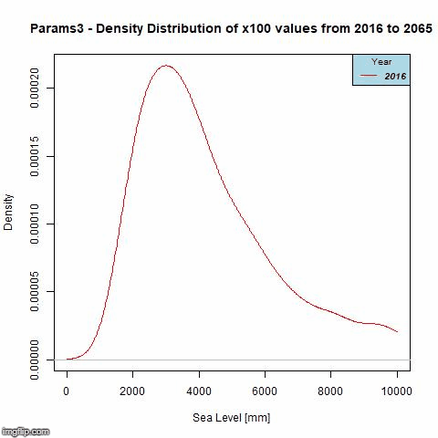

### Parameter Set 4
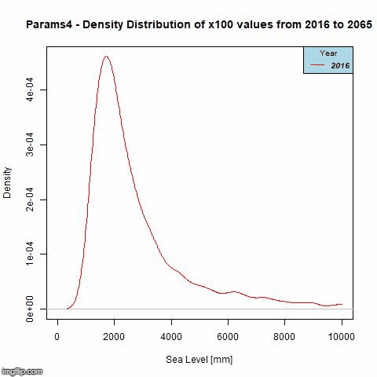

### Parameter Set 5
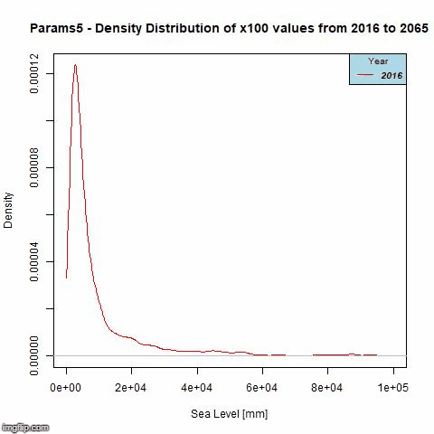

### Parameter Set 6
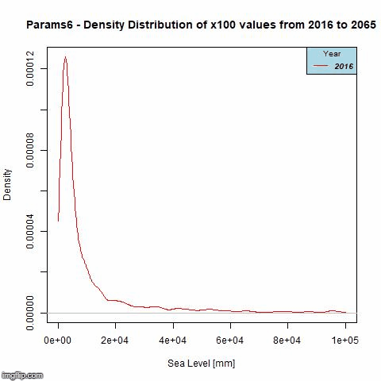

### Parameter Set 7
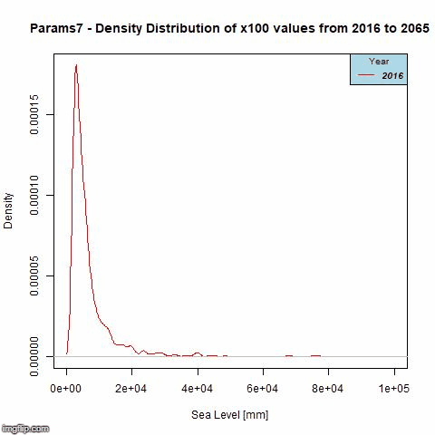

### Parameter Set 8
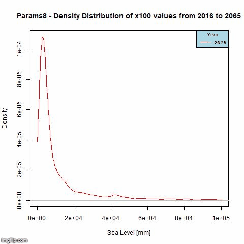

Notice that while the distributions for parameter sets 2 and 4 seem to keep their shape for the entire time-span, the distributions of the other parameter sets eventually becomes very wide and flattens out. The approximate year that this happens is as follows:

- Parameter Set 3: 2042
- Parameter Set 5: 2029
- Parameter Set 6: 2032
- Parameter Set 7: 2036
- Parameter Set 8: 2029

In general, it seems that as the number of non-stationary parameters increases, the time it takes for the distribution to become wide and flat decreases.

Because of this, we decided to try a different method in which we assign weights to each parameter set based on how good we think its data is, pull a value from the distributions, multiply that value by the weight, and form an entire new distribution of 100 year storm values. This method is called Bayseian Model Averaging.

For this method, I will begin by assigning the weights myself and then see how the resulting ditribution turns out. If its data looks better - and mu appears to increase over time rather than decrease - we will run an actual algorithm to determine what the exact weights for each parameter set will be. 

I plotted the distirbution with three different weight values: 

1) 0.8, 0.1, 0.06, 0.01, 0.01, 0.01, 0.01
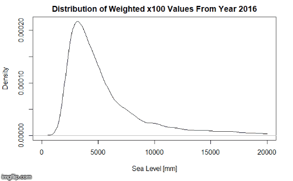
2) 0.9, 0.05, 0.04, 0.0025, 0.0025, 0.0025
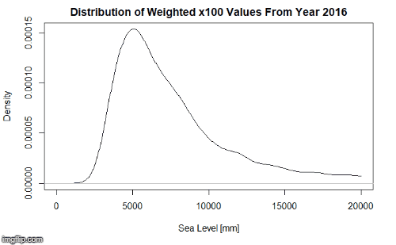
3) 0.6, 0.3, 0.3, 0.025, 0;025, 0.025, 0.025
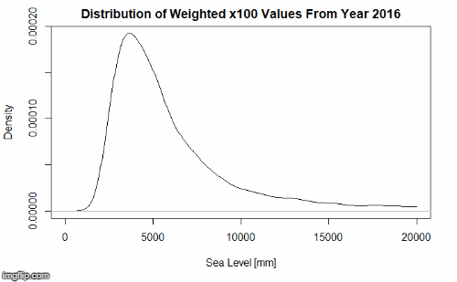

Becuase the distributions move right over time, their mu values must be increasing, which is what we expected to see. So, Tony will run ana anlysis to find out what the exact weights should be. However, notice how the distributions widen out over time - this means that we're losing information as we try to make estimates further and further in the future. Thus, our estimates are becoming less and less accurate as well!

## Week 6

Tony determined what the exact weights should be - his result files can be found in the 'outputs' folder, and I've included them here as well.

models               bma.weights           
[1,] "stationary"         "0.334929830784145"   
[2,] "mu non-stat"        "0.256883114453936"   
[3,] "sigma non-stat"     "9.7942094599098e-05" 
[4,] "xi non-stat"        "0.264857781577595"   
[5,] "mu, sigma non-stat" "3.81122127246433e-05"
[6,] "mu, xi non-stat"    "0.143131709358067"   
[7,] "sigma, xi non-stat" "4.15096912776461e-05"
[8,] "all non-stat"       "1.99998276549952e-05"

We wanted to use these BMA weights to graph the distirbution, but we also wanted to know if the distribution would better keep its shape (and thus retain more information) with smaller return level values. Thus, I graphed the distributions over time for a return level of 25 years, 50 years, 75 years, and 100 years. Note that we began using a 'uniform' parameter set as well as a 'normal gamma' parameter set for this portion of the project. The most important aspect to know is that the 'uniform' parameter set would be expected to proudce less accurate results than the 'normal gamma' paramater set.

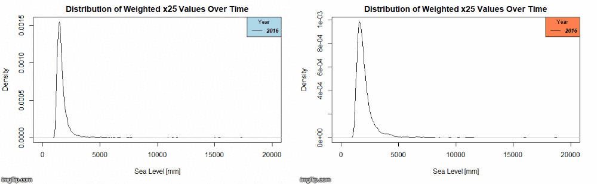
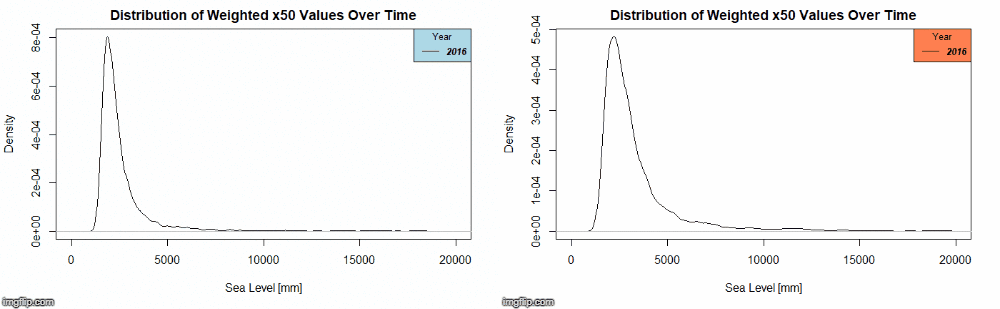
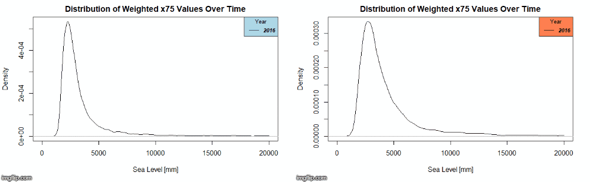
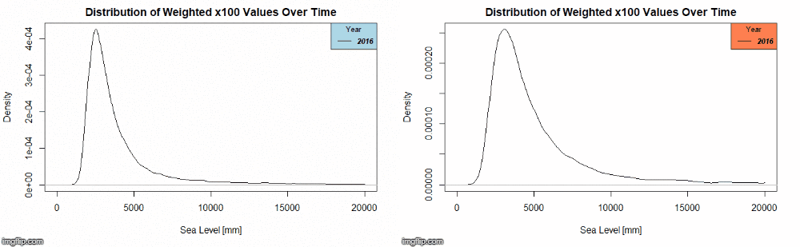

Distribtuions with a smaller return level certainly do seem to better keep their shape as we make estimates further into the future, and it is notable that the 'uniform' distributions seem to better keep their shape than the 'normal gamma' paramter sets.

## Week 6 - Part Two

In the same week, we wanted to measure the entropy (https://en.wikipedia.org/wiki/Entropy_(information_theory) of all 8 models as well as the weighted sitribution using the Uniform and Normal Gamma parameter sets. I wrote multiple functions to help with this task, which can be found in the 'EntropyCalculations' folder. Found within that same folder are images of the results from this exploration, as there are too many images to display in the ReadMe. 

It is notable that entropy seems to be higher across ALL distributions when the Normal Gamma parameter set is used. Also, it appears that entropy actually INCREASES over time for the model 'Parameters 4', where as entropy stays the same for the model 'Parameters 1' and decreases in all other models. Finally, one notices that the entropy over time lines all appear to have an inflection point somewhere before or around the year 2040, which must be investigated.
